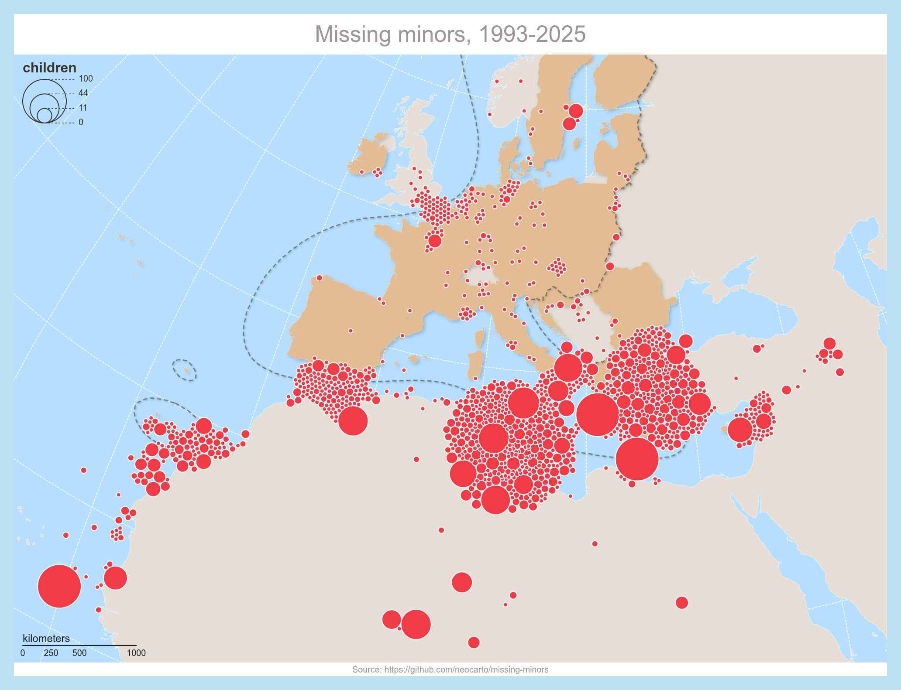

# Missing minors

*by Nicolas Lambert, Francoise Bahoken, Axelle Senou, Joelle Thollot*

In this notebook, we focus on children who have died during migration. To do so, we rely on data collected by the organization [United Against Racism](https://unitedagainstrefugeedeaths.eu/about-united/). This work follows on from the study day “[Geovisualizations of Migration: From Tables to Maps](https://github.com/magisAR9/JE-Geovisualisation-des-migrations)”, jointly organized by UMR 7301 Migrations internationales, espaces et sociétés (MIGRINTER) and UMR 5194 Laboratoire de science sociale (PACTE), with the support of the research initiative (Carto)graphies and (Géo)visualisation of data – AR09 (AR9) of the CNRS GdR MAGIS.

